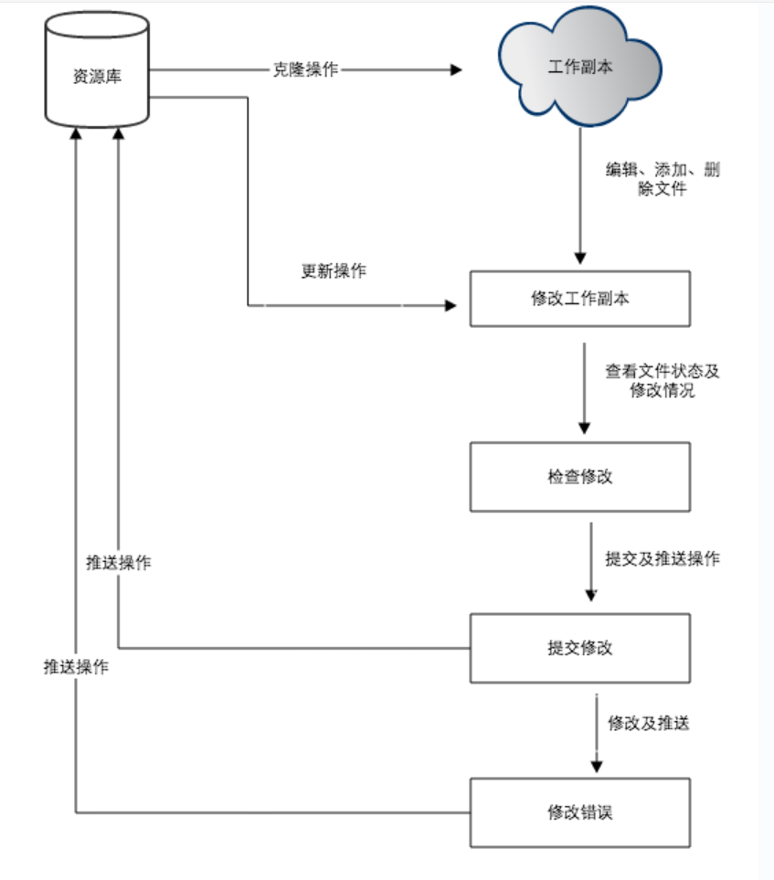
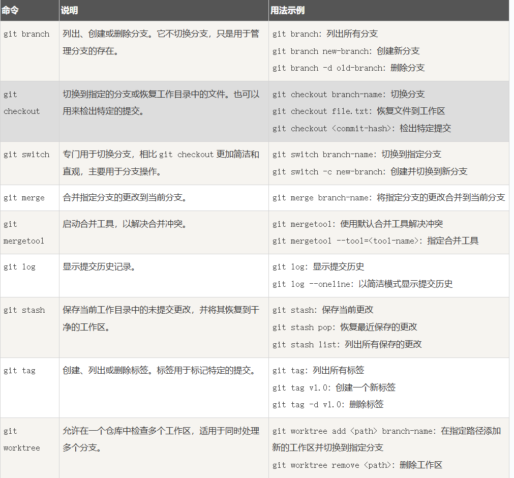
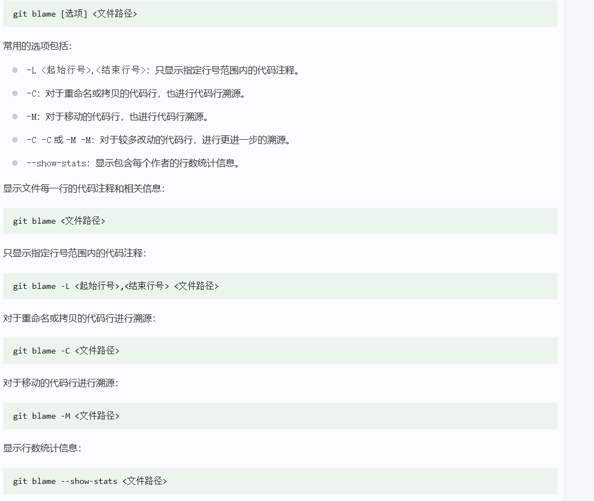
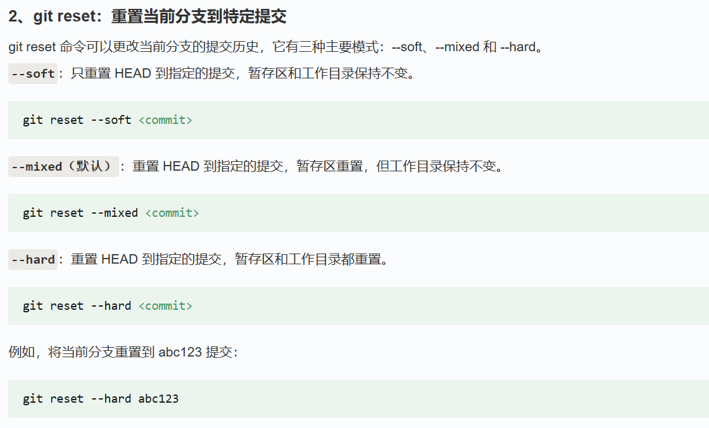
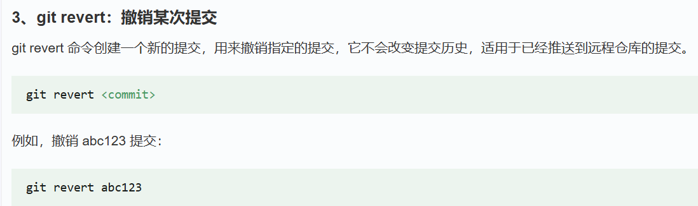
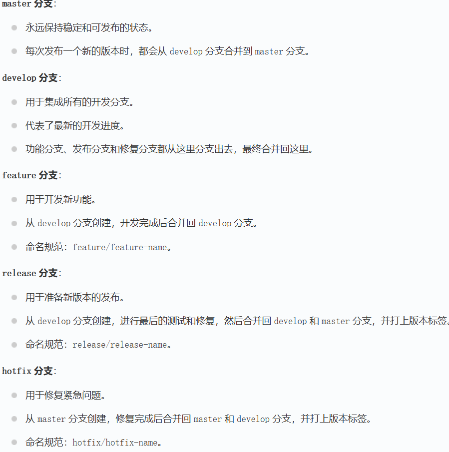
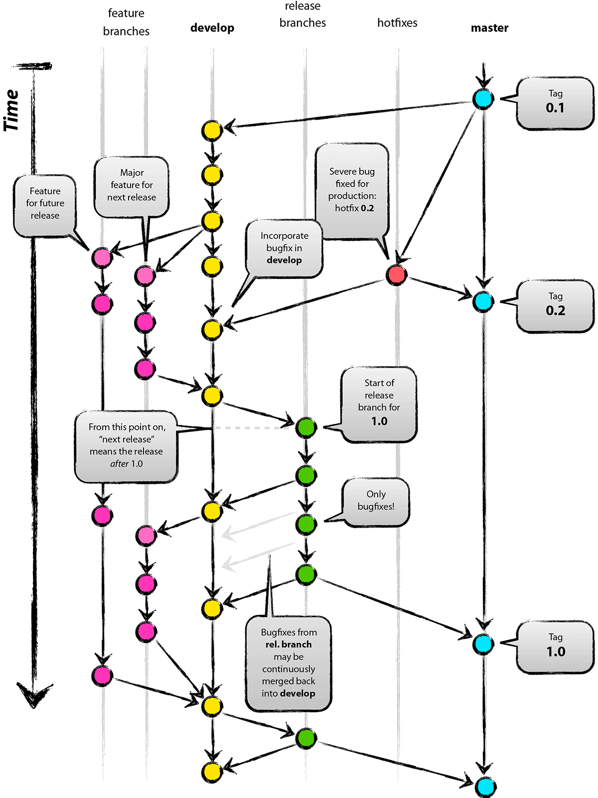
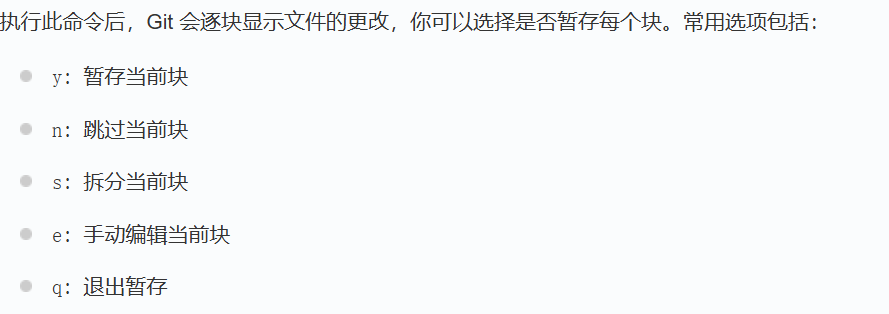

# Version Control
# SVN
## websvn
### docker 构建
1. 搭建#
拉取镜像

Copy
docker pull elleflorio/svn-server
运行镜像

Copy
docker run -d --name svn-server --restart=always -v /opt/dockerData/svnData:/home/svn -p 13690:80 -p 3690:3690 elleflorio/svn-server
创建管理员用户

Copy
docker exec -t svn-server htpasswd -b /etc/subversion/passwd <username> <password>
对持久Volume添加write权限

Copy
chmod -R 777 /opt/dockerData/svnData
2.进入SVN仓库URL#
浏览器地址栏输入http://192.168.0.105:13690/svn，此时会让你输入用户名和密码,用户密码即上面命令行创建的用户和密码，进入后就可以看到仓库列表

浏览器地址栏输入http://192.168.0.105:13690/svnadmin，第一次进入会进行后台的配置管理

配置名称	Value
Subversion authorization file	/etc/subversion/subversion-access-control
User authentication file (SVNUserFile)	/etc/subversion/passwd
User view provider type	passwd
User edit provider type	passwd
Group view provider type	svnauthfile
Group edit provider type	svnauthfile
Repository view provider type	svnclient
Repository edit provider type	svnclient
Parent directory of the repositories (SVNParentPath)	/home/svn
Subversion client executable	/usr/bin/svn
Subversion admin executable	/usr/bin/svnadmin
以上配置填写好后进行test测试，Test passed后再进行保存配置信息，特别注意Parent directory of the repositories (SVNParentPath)一定要Test passed

3.创建仓库及仓库授权#
进入http://192.168.0.105:13690/svnadmin/repositorycreate.php页面进行创建仓库，输入仓库名称、选择仓库类型(默认是文档系统)及预设仓库结构，点击create
进入http://192.168.0.105:13690/svnadmin/accesspathslist.php页面选择已创建的仓库进行用户或组及操作权限(只读及读写)授权
授权完成后就可以进行仓库内容VCS了
### 安装
WebSVN 开源项目安装与使用教程
1. 项目介绍
WebSVN 是一个在线的 Subversion 仓库浏览器，旨在提供一个直观的方式来查看和管理 Subversion 仓库。通过 WebSVN，用户可以轻松查看文件和目录的日志，查看特定版本中文件的更改、添加或删除情况，以及比较两个版本之间的差异。WebSVN 提供了丰富的功能，包括易于使用的界面、可定制的模板系统、文件列表的语法高亮显示、Blame 视图、日志消息搜索、RSS 订阅支持等。

2. 项目快速启动
2.1 安装依赖
在开始安装 WebSVN 之前，请确保您的系统上已经安装了以下依赖：

PHP 5.6 或更高版本
Subversion 1.7 或更高版本
2.2 下载 WebSVN
您可以通过以下命令从 GitHub 仓库下载 WebSVN：

git clone https://github.com/websvnphp/websvn.git
AI写代码
bash
2.3 配置 WebSVN
将下载的 WebSVN 文件放置在您的 Web 服务器的文档根目录中。
修改 browse.php 文件中的 $locwebsvnhttp 变量，以匹配您的目录位置。
在 include/config.php 文件中启用 MultiViews：
$config->useMultiViews();
AI写代码
php
运行
2.4 访问 WebSVN
如果一切配置正确，您可以通过以下 URL 访问 WebSVN：

http://example.com/browse/
AI写代码
3. 应用案例和最佳实践
3.1 应用案例
WebSVN 广泛应用于需要在线查看和管理 Subversion 仓库的场景。例如，开发团队可以使用 WebSVN 来监控代码库的更改，查看特定版本的文件差异，以及管理仓库的权限和访问控制。

3.2 最佳实践
权限管理：建议为 WebSVN 设置访问权限，以确保只有授权用户可以查看和管理仓库。
模板定制：根据团队的需求，定制 WebSVN 的模板，以提供更好的用户体验。
日志监控：利用 WebSVN 的 RSS 订阅功能，实时监控仓库的更改，及时了解项目的最新动态。
4. 典型生态项目
WebSVN 作为一个 Subversion 仓库浏览器，通常与其他 Subversion 相关的工具和项目一起使用。以下是一些典型的生态项目：

Subversion：WebSVN 依赖于 Subversion 作为版本控制系统。
Apache HTTP Server：WebSVN 通常部署在 Apache 服务器上，利用其强大的配置和管理功能。
PHP：WebSVN 使用 PHP 编写，因此与 PHP 生态系统紧密集成。
通过这些生态项目的配合，WebSVN 能够提供一个完整的 Subversion 仓库管理解决方案。

# GIT

## 架构
### 架构内容
工作区
工作地方，进行文件的编辑、添加、删除

暂存区
临时存放修改的一些文件

版本库
包括所有版本历史，每次提交都会有一次历史记录，记录不能改

远程仓库
远程项目集合，用来存放已经完成提交的项目

### 架构基础关系
工作区可以向暂存区利用git add存放修改

暂存区可以向版本库利用git commit -m “Commit message”提交其存放的一些修改

版本库则可以通过git push 将本地版本库的提交推送给远程仓库

版本库还可以通过git pull或者git fetch 从远程仓库获取更新

git pull/push/merge/fetch origin 

## git创建仓库
创建仓库目录
git init初始化
也可以通过git init dir使用指定目录作为仓库

git clone <repo> {<directory>}
克隆 

git config --list 显示目前配置信息
git config -e  编辑当前仓库git配置文件
git config -e --global 针对全部仓库

## 基本操作
### 指令
git add
添加文件到暂存区
git status
查看仓库当前的状态，显示有变更的文件。
git diff
比较文件的不同，即暂存区和工作区的差异。
git difftool
使用外部差异工具查看和比较文件的更改。
git range-diff
比较两个提交范围之间的差异。
git commit
提交暂存区到本地仓库。
git reset
回退版本。
git rm
将文件从暂存区和工作区中删除。
git mv
移动或重命名工作区文件。
git notes
添加注释。
git checkout
分支切换。
git switch （Git 2.23 版本引入）
更清晰地切换分支。
git restore （Git 2.23 版本引入）
恢复或撤销文件的更改。
git show
显示 Git 对象的详细信息。

git log	查看历史提交记录
git blame <file>	以列表形式查看指定文件的历史修改记录
git shortlog	生成简洁的提交日志摘要
git describe	生成一个可读的字符串，该字符串基于 Git 的标签系统来描述当前的提交

git remote	远程仓库操作
git fetch	从远程获取代码库
git pull	下载远程代码并合并
git push	上传远程代码并合并
git submodule	管理包含其他 Git 仓库的项目

### git文件
工作区： 
Untracked 新创建的文件 git还没记录 Modified  已被追踪但发生更改未被提交

暂存区
放

文件状态的查看
git status

## gitlab

## girret

### git log  查看日志
--oneline 简洁
--before={}在什么时间前
--after={}
--since=""从什么时间开始
--until=""到什么时间结束
--author=""查看是谁做的

### git blame  查看变更

### git reset 重置提交
软 只重置提交 暂存工作区均保持不变
混合 暂存变
硬 都变

### git revert  撤销

### git reflog 类似于去垃圾站，可以恢复文件

找到并恢复
git reset --hard HEAD@{n}

### git tag  给某项记录打标签（无操作则是查看所有）
-a 创建带注解的标识（推荐使用）
git log --decorate 能看到自己标识

-d 删除本地

tag可被推送
远程的删除用git push origin --delete 
git tag -a <tagname> -m "message" 附带标签信息
git show 查看标签信息

## git FLow分支模型

git flow init
初始化git flow
下来可以从develop下分支feature
git flow feature start 名字
git flow feature finish 名字

当功能撰写完毕
可以创建发布release分支
git flow release start 名字
git flow release finish 名字

如果这个过程中出现紧急修复事件
则可以从master下创建hotfix分支
git flow hotfix start 名字
                finish

## git进阶操作
### 交互式暂存
git add -p 选块暂存

### git stash
 临时保存工作进度
 git stash 保存当前进度
 git stash list 查询已保存
           apply 应用最近一次存储
           pop 应用并删除
           drop stash@{n} 删除特定
           clear 清空