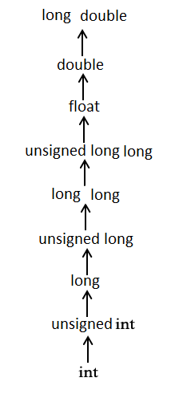

# 这是一个C语言笔记
## 一、各种基础
### 1、类型
    sizeof(  
    int 4;  
    char    1;  
    float 4;  
    double 8;  
    short 2;  
    long  4；  
    )
### 2、结构体
sizeof结构体几位内部加和
### 3、位域
位域就是限制变量占用的位数，同时限制了变量大小。当其满足位数能够放在同一内存空间下时能节省空间

    #include <stdio.h>
    #include <string.h>
 
    /* 定义简单的结构 */
    struct
    {
        unsigned int widthValidated;
        unsigned int heightValidated;
    } status1;
    8 字节
  
    /* 定义位域结构 */
    struct
    {
        unsigned int widthValidated : 1;
        unsigned int heightValidated : 1;
    } status2;
 
    int main( )
    {
        printf( "Memory size occupied by status1 : %d\n", sizeof(status1));
        printf( "Memory size occupied by status2 : %d\n", sizeof(status2));
 
        return 0;
    }
    4 字节

其实就是物尽其用int是4个字节，每个量只用一个位，用不完4个字节，所有都放在一个int下
## 二、文件输入输出
### 1、输入输出格式符
#### 1.1、%d   
  整型int
#### 1.2、%s  
  字符串
#### 1.3、%f  
  浮点数
#### 1.4、%c  
  字符
### 2、输入输出的特殊函数
#### 2.1、getchar  

    int c;
    c=getchar();//这里取得的是屏幕输入第一个字符的ascii值。
#### 2.2、putchar
    
    putchar(c)//将上方的的字符输出
#### 2.3、fgets

    fgets(str,sizeof(str),stdin)//fgets(字符串，字符长度，File*stream//文件流(stdin/stdout));
#### 2.4、fputs
    
    fputs(str,stdout)

### 3、文件输入输出
#### 3.1、fopen()

    FILE *fopen(const char *filename, const char *mode);//文件名，要进行的操作
#### 3.2、fclose()

    int fclose(FILE *stream);
#### 3.3 模式
|模式|描述|
|-----|-----|
|r	|打开一个已有的文本文件，允许读取文件。|
|w	|打开一个文本文件，允许写入文件。如果文件不存在，则会创建一个新文件。在这里，您的程序会从文件的开头写入内容。如果文件存在，文件内容会被清空（即文件长度被截断为0）。|
|a	|打开一个文本文件，以追加模式写入文件。如果文件不存在，则会创建一个新文件。在这里，您的程序会在已有的文件内容中追加内容。|
|r+	|打开一个文本文件，允许读写文件。|
|w+	|打开一个文本文件，允许读写文件。如果文件已存在，则文件会被截断为零长度，如果文件不存在，则会创建一个新文件。|
|a+	|打开一个文本文件，允许读写文件。如果文件不存在，则会创建一个新文件。读取会从文件的开头开始，写入则只能是追加模式。|
## 三、预处理
### 1、宏定义
#define  宏定义  
#undef   取消宏定义
### 2、ifndef/define/endif
#ifndef  
#define  

    /代码
#endif  
宏未定义则定义后编译，防止头文件被重复包含
### 3、define/ifdef/endif
宏已被定义则编译
### 4、#error
编译错误后输出错误信息
### 5、分支
#if  
#else if  
#else
### 6、常用头文件  
|头文件	|功能简介|
|------|-------|
|<stdio.h>	|标准输入输出库，包含 printf、scanf 等函数|
|<stdlib.h>	|标准库函数，包含内存分配、程序控制等函数|
|<string.h>	|字符串操作函数，如 strlen、strcpy 等|
|<math.h>	|数学函数库，如 sin、cos、sqrt 等
|<time.h>	|时间和日期函数，如 time、strftime 等|
|<ctype.h>	|字符处理函数，如 isalpha、isdigit 等|
|<limits.h>	|定义各种类型的限制值，如 INT_MAX 等|
|<float.h>	|定义浮点类型的限制值，如 FLT_MAX 等
|<assert.h>	| 断言宏 assert，用于调试检查|
|<errno.h>	|定义错误码变量 errno 及相关宏
|
|<stddef.h>	|定义通用类型和宏，如 size_t、NULL 等
|
|<signal.h>	|处理信号的函数和宏，如 signal 等|
|<setjmp.h>	|提供非本地跳转功能的宏和函数|
|<locale.h>	|地域化相关的函数和宏，如 setlocale 等|  
## 补充知识：
### 1、类型转换

### 2、错误处理
#### fprintf()函数
fprintf(stream流，文本内容，变量)
#### perror
perror（错误提示文本），会显示当前的错误内容在文本后
#### strerror
strerror（错误号）会返回当前错误内容  
### 3、 可变参数stdarg.h

    #include <stdio.h>
    #include <errno.h>
    #include <string.h>
    #include<stdarg.h>
    static int group;
    void function(int num,...){
        group++;
        va_list valist;//va_list声明可变参数列表
        va_start(valist,num);//初始化
        printf("第%d组数字为：\n",group);
        for(int i=1;i<=num;i++){
            printf("第%d个为：%d\n",i,va_arg(valist,int));//va_arg取得下一个参数。
        }
        va_end(valist);//释放空间
    }
    int main ()
    {
        function(1,1);
        function(2,2,3);
        function(3,4,5,6);
        return 0;
    }
### 4、内存使用管理#stdlib.h
#### calloc（num,size）
  内存中取num个size大小的空间,会初始化为0
#### malloc（num）
  堆中拿出一块指定大小的空间 
  char *a=(char *)malloc(200*sizeof(char));
#### realloc(*address,num)
  重新分配内存大小
#### free（*address）
  释放空间

### 5、安全函数C11引入的
  很多大部分都是
  函数_s
  有的是s函数_s
  此类函数大多解决的是冲突之类的问题，比如进行缓冲区大小的检查，尽心上下文的引用，避免了很多问题产生。
  such as
  strcpy_s
  sprintf_s

_itoa_s 和 _ultoa_s：安全版本的整数转换函数，将整数转换为字符串时检查目标缓冲区大小。

    errno_t _itoa_s(int value, char *buffer, size_t sizeOfBuffer, int radix);
    errno_t _ultoa_s(unsigned long value, char *buffer, size_t sizeOfBuffer, int radix);  
 _strlwr_s 和 _strupr_s：将字符串转换为小写或大写的安全版本。

    errno_t _strlwr_s(char *str, size_t numberOfElements);
    errno_t _strupr_s(char *str, size_t numberOfElements);

### 文件
FILE*pf 文件指针变量
为文件开辟一个相应的信息区域

#### 文件打开与关闭
fp=fopen(filename,mode)
mode有
r只读,打开文本文件
w只写，建立新文件
a追加，尾部追加内容

b(二进制)
rb 只读 打开二进制
wb  。。。。。。
ab 。。。。。。。
fclose(fp)

+(读写)
r+
b+
a+
#### 文件顺序读写（上文件输出，输入内存，输入流；下文件输入，内存数据输出，输出流）
EOF(-1)
##### 字符
int fgetc（FILE *fp）
不错返回输出字符，错返回EOF
int fputc（int char ,FILE *fp）
char是字符的int值
不错返回输入的字符，错返回EOF

##### 文本行
char* fgets(char *s ,int n,FILE *fp)
成功返回首地址，失败NULL
int fputs(const char *s,FILE *fp)$~~~~~$ps:不会再字符串末尾加\n
成功非负，错误EOF

##### 格式化
int fscanf(FILE *fp,const char*format,....)
int fprintf(FILE *fp,const char*format，...)
format为格式字符 ...为参数列表
类似于：

    printf(format ,...)
    fprintf(fp,"哟哟哟%d%s",n,s);
成功返回字符数，失败返回负值

##### 二进制
size_t fread(const void *ptr,size_t size,size_t nmemb,FILE *stream）
size_t fwrite(const void *ptr,size_t size,size_t nmemb,FILE *stream)
ptr: 指向元素数组的指针（用于输入或者输出获取）
size: 每个元素大小
nmemb:元素个数
stream:文件流

eg:

    char a[]="sadasafafasda";
    char out[20];
    fwrite(a,strlen(a)+1,1,fp);
    frend(out,strlen(a)+1,1,fp);

#### 文件定位
##### fseek
int fseek(FILE *fp long offset,int fromwhere)
成功返回0，失败返回非0
文件，偏移量，从哪里开始
fromwhere:
(1)SEEK_SET/0  文件开始
(2)SEEK_CUR/1 当前
(3)SEEK_END/2 结尾

##### rewind
void rewind(fp)
重置位置指针到文件首部
##### ftell
long ftell(FILE *fp)
用来读取当前相对于文件起始的偏移

#### 文件检测
##### ferror
int ferror(FIlE *Stream)
0对 非零错
##### feof
int feof(FILE *fp)
检测是否结束，文件结束，返回非0
文件结束符只能被clearerr（）清楚
##### fflush
int fflush(FILE *fp)
清楚缓冲区内容。