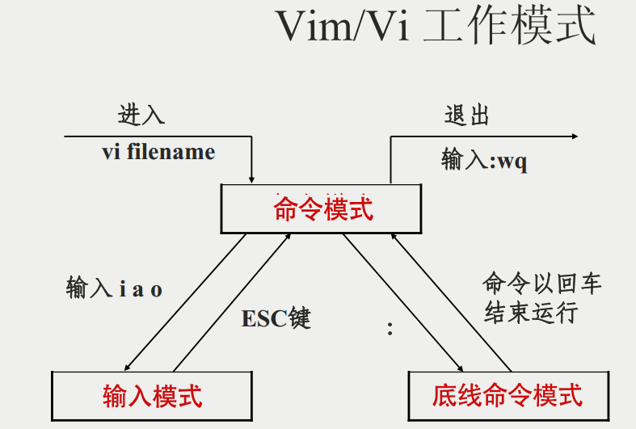
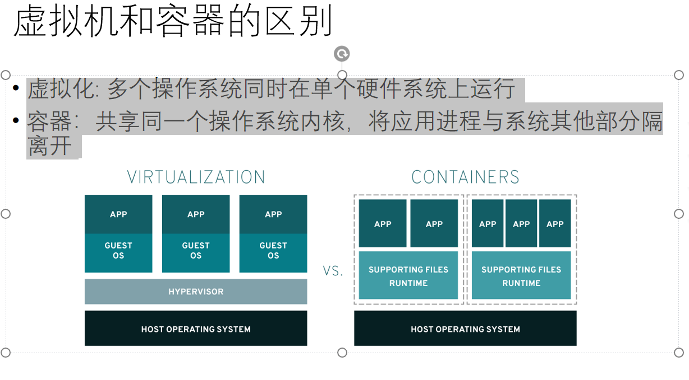
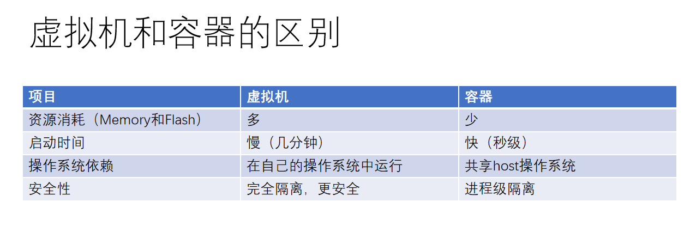

# 这是一个Linux学习笔记
## 一、基础
Linux7个运行级别
0  系统停机状态
1  单用户工作状态
2  多用户状态（无NFS）
3  完全多用户状态（有NFS）登录进控制台
4  系统未使用
5  x11控制台，登录后进入图形GUI模式
6  系统正常关闭重启
默认级别不可设置为0，6
### 1、系统重要目录

|目录名|存放内容|
|------|-------|
| /bin | 存放最经常使用的命令|
|/boot | 存放启动linux时使用的一些核心文件|
|/dev  |存放一些Linux外部设别|
|/etc  |存放所有系统管理所需要的配置文件|
|/home |用户自己的主目录|
|/lib  |存放系统最基本的动态链接共享库|
|/root |超级权限用户|
|/mnt  |临时挂载别的文件系统|

### 2、文件基本属性

bin文件的10位字符所代表含义
|* |*** |*** |***|
#### 第一位  
  
 d   目录
‘-’  文件  
 l   链接文档
 b   装置文件里面的可供存储的接口设备
 c   装置文件中的串行端口设备
#### 余下的参数组合
  rwx  rwx  rwx
  r代表可读，w代表可写，x代表可执行
  文件所有者 文件所屬組  其他人
  无权限则为-

## 二、命令
### 1、更改文件属性
#### chgrp:更改文件属组
chgrp [-R] 属组名 文件名
-R 递归更改文件属组
#### chown：更改文件所有者（owner），也可以同时更改文件所属组
chown [-R] 所有者 文件名
chown [-R] 所有者：属性名 文件名
-c
-f
-v 
同下

    eg：
    chown username filename
    chown username:groupname filename
    chown :groupname filename
    chown 1000:1000 filename(数字ID)
#### chmod：更改文件9个属性 [] 权限模式（ugo (+?)） 文件
-c 已更改，显示更改动作
-f 无法更改也不显示错误
-v 显示权限变更的详细资料
-R 递归更改权限变更
九个权限分三组分别是
 owner/ group/ others
权限分数分别为：r4，w2, x1

### 2、文件与目录管理
绝对路径（根目录写起/user/doc/doc），相对路径（../man）
#### 处理目录的常用命令
|命令|--op|作用|
|----|------|----|
|ls  |-l -a -s |列出目录及文件名|
|cd |.. / ~ |切换目录 |
|pwd |-L(逻辑) -P（物理）|显示目前的目录
|mkdir | make directory|创建一个新的目录|
|rmdir|remove directory|删除一个空的目录|
|cp|copy file|复制文件或目录
|rm|remove| 删除文件或目录|
|mv|move file|移动文件与目录，或修改文件与目录的名称|
##### ls 列举
-a  全部 
-d  目录本身
-l  长数据串列
##### cd 切换
绝对路径、相对路径、~（回最开始目录）、..（回上一级）
##### pwd 显示目前所在目录
-P 显示出确实的路径
##### mkdir 创建新目录
-m 直接配置权限
-p 帮助直接将需要的目录递归创建起来
##### rmdir 删除空目录
-p 从该目录起，一次删除多级空目录
##### cp 复制文件或者目录
-a 约等于 -pdr
-d 复制链接当属性
-f 为强制意思
-i 目标已存在会覆盖
-I 进行硬链接
-p 连同文件的属性一起复制
-r 递归持续复制
-s 复制成为符号链接当
-u 目标比源文件旧才升级
##### rm 移除文件或目录
-f 强制
-i 互动模式
-r 递归删除
##### mv 移动文件或目录 或者修改名称
-f 强制
-i 目标文件已经存在则覆盖
-u 目标比源文件旧才升级
### 3、文件内容查看
#### cat 从第一行开始看文件内容
-A ..
-b 列出行号
-E 结尾的断行字节＄
-n 空白也有行号
-T tab 以^|显示出来
-v 列出看不出来的特殊字符
#### tac 倒着看
#### more 一页一页翻动
#### less 功能更多的more可上下翻
#### head 取出文件前面几行
-n number 显示几行
#### tail 取出后面几行
-n number 显示几行
-f 勘测后面所接档名
### 4、磁盘管理
#### df 列出文件系统磁盘空间占用情况
-h 以人类可读方式
-T 显示文件类型
-t<> 指定文件类型
-H 是-h变体 用1000字节为基本单位
-k KB
-a 显示所有文件系统
#### du 对文件和目录磁盘使用的空间
-a 列出所有文件与目录容量
-h 人类易懂
-s 仅显示指定总大小
-S 子目录下的总计
-k KB
-m MB
#### fdisk 磁盘分区表操作
-l 输出后面接的装置所有的分区内容
#### mkfs 格式化
-t 可以接文件系统格式
#### fsck 用来检查和维护不一致的文件系统
///很多不写了
#### mount/umount 磁盘挂载与卸载

    mount [-t 文件系统] [-L Label名] [-o 额外选项] [-n]  装置文件名  挂载点

    umount [-fn] 装置文件名或挂载点
### 5、vi编辑器
vi/vim
键盘图

#### 命令模式
i 输入
x 删除光标处字符
esc ： 切换底线命令
a 插入
o 当前行下一行插入
O      上
dd 剪切当前行
yy 复制当前行
p 剪贴板粘到光标下方
P 剪贴板粘到光标上方
u 撤销上次操作
ctrl r  重做上次撤销操作
:w 保存
:q 退出
:q! 退出不存
工作模式

## 三、管理包
### 1、yum shell前端软件管理器（Fedora,RedHat,SUSE）

### 2、apt shell前端软件包管理器（Debian和Ubuntu）

*********************************

### linux 容器
Linux 容器（container）是与系统其他部分隔离开的一个或一组进程。运行这些进程所需的所有文件都由另一个特定镜像提供 （意味着从开发到测试再到生产整个过程中，Linux 容器都是可移植且一致的）。
### 虚拟机
虚拟机（Virtual Machine）指通过软件模拟的具有完整硬件系统功能的、运行在一个完全隔离环境中的完整计算机系统。
### 

###

vagrant
在通过vagrant下载docker
