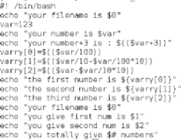
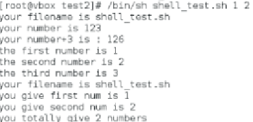
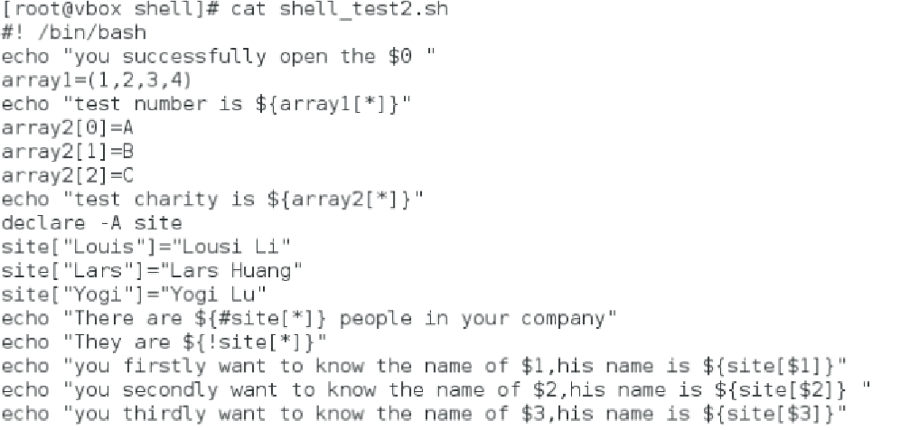
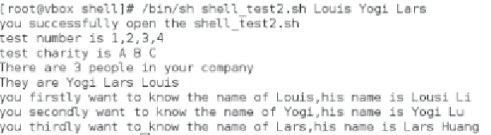
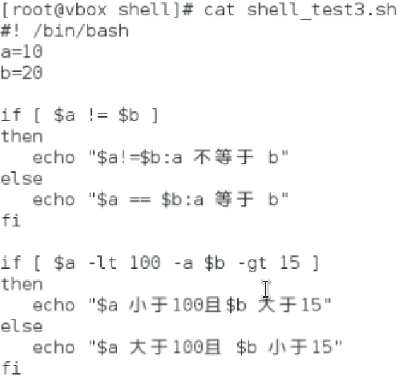
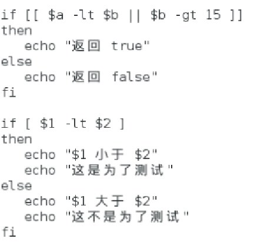
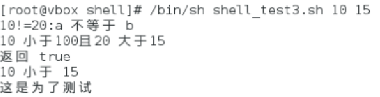

# shell
## 变量
### 环境变量
printenv 用于显示
### 本地变量
set 用于显示
export来将本地导出为环境
unset 删除已定义的环境或者本地变量
## 代换
### 文件名代换
.  *  匹配0或多个 
.  ？ 匹配一个
.  [] 匹配任意

### 命令代换
` /$()
### 算术代换
$(()) 将变量取值为整数
其中只能进行加减乘除整数运算
### 转义字符 \
用于去除紧跟其后的单个字符的特殊意义，取字面值
### 单引号
字符串界定符
保持引号内所有的字符字面值
### 双引号
保持字面值
以下除外
|符号|意义|
|------|--------|
|$变量 |取变量值|
|` |仍表示命令替换|
| \\$ |表示$的字面值|
|\\` |表示`的字面值|
|\\" |表示"的字面值|
|\\\ |表示\的字面值|
## 语法
运行shell文件的两种方法
 (1)
chmod +x ./test.sh
./test.sh
 (2)
/bin/sh test.sh

### 开头
#！/bin/bash
### 传递参数
|参数处理	|说明|
|-------|---|
|\$0|文件名(包含路径)|
|\$1-9|第1-9个参数|
|\${10以上}|第10以上的参数|
|\$#	|传递到脚本的参数个数
|\$*	|以一个单字符串显示所有向脚本传递的参数。如"\$*"用「"」括起来的情况、以"\$1 \$2 … \$n"的形式输出所有参数。
|$$	|脚本运行的当前进程ID号
|$!	|后台运行的最后一个进程的ID号|
|\$@	|与\$*相同，但是使用时加引号，并在引号中返回每个参数。如"$@"用「"」括起来的情况、以"\$1" "\$2" … "\$n" 的形式输出所有参数。
$-	|显示Shell使用的当前选项，与set命令功能相同。
$?	|显示最后命令的退出状态。0表示没有错误，其他任何值表明有错误。
#### 参数传递代码

#### 编译情况

## 数组代码与编译

## 运算符
### 基本运算符
\+ - * / % =
== !=
### 关系运算符
|关系符|作用 |
|-----|-----|
|-eq|相等则true|
|-ne|不等则true|
|-gt|大于则true|
|-lt|小于则true|
|-ge|大于等于则true|
|-le|小于等于则true|

### 布尔运算符
 ！非
 -o 或|
 -a 与&
### 逻辑运算符
&&逻辑and
||逻辑or

#### 代码结果

### 字符串运算符
= 相等
！= 不等
-z  长度为0  eg: -z  $a
-n  长度不为0  eg: -n $b
\$ 不为空

### 文件测试运算符
|操作符	|说明	|举例|
|-----|-----|-----|
|-b file	|检测文件是否是块设备文件，如果是，则返回 true。|	[ -b $file ] 返回 false。|
|-c file	|检测文件是否是字符设备文件，如果是，则返回 true。	|[ -c $file ] 返回 false。|
|-d file	|检测文件是否是目录，如果是，则返回 true。	|[ -d $file ] 返回 false。|
|-f file	|检测文件是否是普通文件（既不是目录，也不是设备文件），如果是，则返回 true。	|[ -f $file ] 返回 true。|
|-g file	|检测文件是否设置了 SGID 位，如果是，则返回 true。|	[ -g $file ] 返回 false。|
|-k file	|检测文件是否设置了粘着位(Sticky Bit)，如果是，则返回 true。|	[ -k $file ] 返回 false。|
|-p file	|检测文件是否是有名管道，如果是，则返回 true。	|[ -p $file ] 返回 false。|
|-u file	|检测文件是否设置了 SUID 位，如果是，则返回 true。|	[ -u $file ] 返回 false。|
|-r file	|检测文件是否可读，如果是，则返回 true。	|[ -r $file ] 返回 true。|
|-w file	|检测文件是否可写，如果是，则返回 true。|	[ -w $file ] 返回 true。|
|-x file	|检测文件是否可执行，如果是，则返回 true。	|[ -x $file ] 返回 true。|
|-s file	|检测文件是否为空（文件大小是否大于0），不为空返回 true。	|[ -s $file ] 返回 true。|
|-e file	|检测文件（包括目录）是否存在，如果是，则返回 true。	|[ -e $file ] 返回 true。|

### 自增自减
let   ++
let   --
 $(())算术运算

## 操作命令
### echo命令
#### 普通
（1）直接输出；
（2）-n 不换行输出
（3）-e 启动转移字符
|转义序列|说明|
|-|-|
|\n | 换行| 
|\t | 水平制表
|\v|垂直制表
|\b|退格
|\r|回车
|\\\\  |反斜杠字符本身

eg: echo -e "Firstline\nSecond line"
#### 高阶
(1) 重定向输出>/>>
 为了追加内容
(2) 彩色输出
(3) 输出命令执行结果

### printf命令
|字符|含义|
|--|--|
|%s|字符串
|%d|十进制
|%f| 浮点
|%c| 字符
|%x| 十六进制
|%o| 八进制
|%b| 二进制
|%e|科学计数法浮点

### test命令
 [  --------------------]
## 流程控制
### 判断
#### if
    if 
    then
        ....
    elif
    then
        .....
    else
        .....   
    fi

[]只能用指令
（（））可以使用> <
#### case esac
    case 值 in
    模式1）

    模式2）

    esac

### 循环
#### for循环

    for  var  in  item1  item2 ...  itemN(多时可以使用{item1..itemN})
    do
       ....
       .....
       .....
    done
for循环不像c可以进行数字计数输出，但可以直接将属组中的事物按顺序输出

#### while循环（true 行）

    while condition
    do

    done

##### 无限循环
##### (1)
while :
do

done

##### (2)
while true
do

done
##### (3)
for(( ; ; ))

#### until循环(true 停)

    until condition
    do

    done

## 函数

    [function] funname [()]{
        action;
        [return int;]
    }

## 输入输出
### 输出重定向
command1 > file1  文件1输出
### 输入重定向
command1 < file1  文件1输入 覆盖
command  << file1  文件1读入，直到遇到分解符为止^  追加

### read
输入

shell 脚本执行
chmod +777 ./  .sh
./  .sh

## 补充
"$a"=${a}
### 变量
#### readonly
设置变量为已读

#### unset
删除变量

#### declare -i
声明整数变量

#### 数组变量
my_arr=(a b c d e)
#### 环境变量
$PATH

### 字符串

#### 获取字符串长度
${#string}
#### 提取子字符串
${string:m:n}
从m开始取n个
#### 查找子字符串

echo `expr index "$string" str`
在string中查找str（可以查到str位置从1开始）

### 数组
arr_name=(v1 v2 v3 v4 v5)

#### 读取数组
${arr_name[index]}
${arr_name[@]}读全部

#### 关联数组
declare -A
可以用string当键值

#### 获取全部元素
获取所有值 ${arr[*]}
获取所有键值 ${!arr[*]}

(())神器，可以判断直接用符号，让自增直接进行，转为算术

[[]]支持正则，支持模式匹配