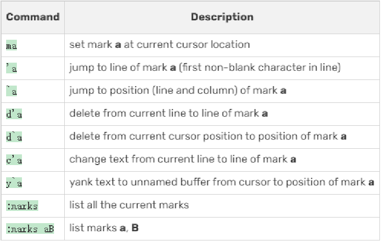

# This is a Vimmarkd
vi/vim 进入vim模式
a/i/o进入insert
Esc 进入正常模式

## saving 
w saving（写入）
w filename写入指定文件
q 退出
q! 强制退出

## moving 
h 左
l 右
j 下
k 上
0 行首
$ 行尾
w 前一步
b 后一步
gg 文件首
G 文件尾
ctrl  u 上半屏
ctrl  d 下半屏

## deleting
dw一个字符
dd一行
d0删到行首
d$删到行尾

## select

v选一个字符
V选一行字符

u 回退 
CTRL r  恢复

## copy
yy 行
yw 字符

p paste

## search replace
/text 查找，前向后
n 上一个
N 下一个
？text 后向前
：%s/text/replacement/g 替换

## 分屏
：sp file 横分
：vs file 竖分
ctrl ww 下一个窗口
ctrl w +h/j/k/l 不同窗口

vim -d file1 file2 对比两个文件
]c 上不同
[c 下不同
dp 同步差异
do 同步差异

## 标记

|命令	|描述|
|-------|---|
|ma	|在当前光标位置设置标记 a
|’a	|跳转到标记 a 所在的行（行首第一个非空白字符处）
|\`a	|跳转到标记 a 的精确位置（包括行和列）
|d’a	|删除从当前行到标记 a 所在行的内容
|d\`a|	删除从当前光标位置到标记 a 的精确位置的内容
|c'a	|修改从当前行到标记 a 所在行的文本
|y\`a|	将光标到标记 a 的精确位置之间的文本复制到未命名缓冲区
|:marks|	列出所有当前标记
|:marks aB	|列出标记 a 和 B

## 寄存器a-z 0-9 A-Z
：reg 列出所有寄存器
"ayy   这行放入寄存器a
"ap    读寄存器并粘贴过来
ctrl-r 加寄存器名字 复制文本到寄存器
