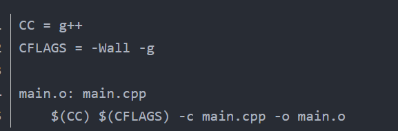
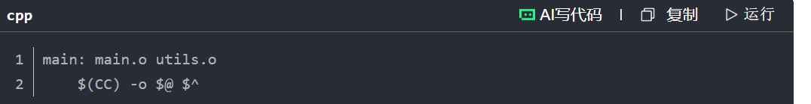
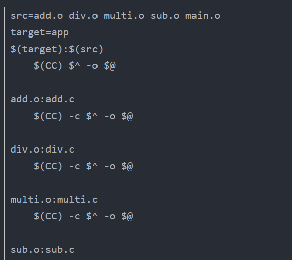

# makefile前提知识GCC
gcc
gcc option filenames
预处理----> 编译------> 汇编-------> 链接
||||
|------- | ------ |------|
|-E      |预处理   | 生成.i|
|-S      |编译     |生成.s|
|-c      |汇编     |生成.o|
|-o      | 链接   |生成可执行文件./ .out|

-Wall   &nbsp;&nbsp;&nbsp;&nbsp;&nbsp;&nbsp;&nbsp;&nbsp;&nbsp;&nbsp;&nbsp;&nbsp;&nbsp;&nbsp;&nbsp;&nbsp;&nbsp;开启编译器警告
-g     &nbsp;&nbsp;&nbsp;&nbsp;&nbsp;&nbsp;&nbsp;&nbsp;&nbsp;&nbsp;&nbsp;&nbsp;&nbsp;&nbsp;&nbsp;&nbsp;&nbsp;&nbsp;&nbsp;&nbsp;&nbsp; 生成调试信息
-Werror &nbsp;&nbsp;&nbsp;&nbsp;&nbsp;&nbsp;&nbsp;&nbsp;&nbsp;&nbsp;&nbsp;&nbsp;&nbsp; 所有警告当错误

        参数名称	含义
        -E	仅执行预处理，不进行编译、汇编和链接（生成后缀为 .i 的预编译文件）
        -S	执行编译后停止，不进行汇编和链接（生成后缀为 .s 的预编译文件）
        -c	编译程序，但不链接成为可执行文件（生成后缀为 .o 的文件）
        -o	直接生成可执行文件
        -O/-O1/-O2/-O3	优化代码，减少代码体积，提高代码效率，但是相应的会增加编译的时间
        -Os	优化代码体积（多个-O参数默认最后一个）
        -Og	代码优化（不能与“-O”一起用）
        -O0	关闭优化
        -l [lib]	（这里是小写的L，命令无中括号，下同）指定程序要链接的库，[lib]为库文件名称。如果gcc编译选项中加入了“-static”表示寻找静态库文件
        -L [dir]	指定-l（小写-L）所使用到的库文件所在路径
        -I [dir]	（这里是大写的I）增加 include 头文件路径
        -D [define]	预定义宏
        -static	链接静态库生成目标文件，禁止使用动态库（在支持动态链接的系统上）
        -share	尽量使用动态库，但前提是系统存在动态库，生成的目标文件较小
        -shared	生成共享文件，然后可以与其它文件链接生成可执行文件
        -fpic	生成适用于共享库的与地址无关的代码（PIC）（如果机器支持的话）
        -fPIC	生成与位置无关的的代码，适用于使用动态库，与“-fpic”的区别在于去除去全局偏移表的任何限制（如果机器支持的话）
        -fPIE	使用与地址无关的代码生成可执行文件
        -w	不输出任何警告信息
        -Wall	开启编译器的所有警告选项
        -g	生成调试信息，方便gdb调试
        -v	查看gcc编译器的版本，显示gcc执行时的详细过程
        -ggdb	加入GDB调试器能识别的格式
        -Werror	将所有的警告当成错误进行处理，在所有产生警告的地方停止编译
        -M	生成适合于make规则的主要文件的依赖信息
        -MM	与“-M”相比忽略由“#include”所造成的依赖
        -MD	与-M作用类似，将输出导入到 .d 文件中
        -MMD	与-MM作用类似，将输出导入到 .d 文件中
        –help	查看帮助信息（注意前面是两个“-”，一个“-”不行）
        –version	查看版本信息（注意前面是两个“-”，一个“-”不行）

gcc option filenames
gcc -?  src  -o   target   
其含义是将多个src内容放在target中，集中编译
而makefile会给出所有依赖
即谁的生成依赖于谁，以此来完成程序的按部执行

又是也可能出现gcc -c arebit a b c(表明生成arebit 要用到a,b,c)

