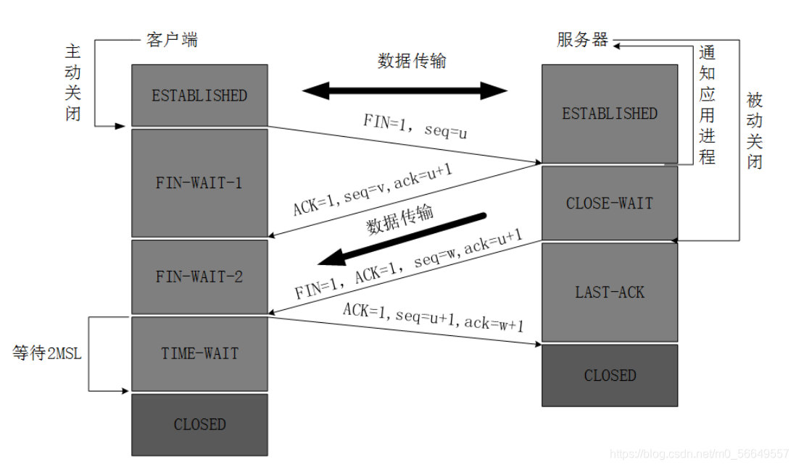

# IOT

## s1 server功能

KPI Uploader

Log Uploader

AWS IoT Core（直接连接功能）
onboard 设备上线，与云做配对
FOTA 
Provision 预览
DM（device management）设备管理
Event Notification 事件上报

KVS webRTC （实时视频）                      
实时流
本地CVR

KVS Producer（上报，录影传云端）
上传剪辑
云端CVR
### 接口
CGI
stream socket
event socket
local file

## Video

Resolution   分辨率

Codec 编/解码器

Frame rate帧率,每秒画面

bit rate

bit rate=分辨率x帧率x像素（基色所占位数与每个基色所占范围位数相乘）

## Audio
Codec
Sample size
Sample rate
Bit rate=Sample rate x 位深度 x 声道
Channal

## 文件格式：

Codec：VP8/9,H264/H265
文件压缩算法
Containers：MOV FLV MKV 3GP AVI TS
文件格式
MPEG4 is a codec 
mp4 is a file container

## 流媒体传输协议

### RTSP(实时流媒体传输协议)
实时，大多结合实时传输协议RTP和实时控制协议RTCP

### RTP

### webRTC

局域网下，手机和app

# 部门工作

## SWPA

S1  FVT/DVT 项目测试

S2  EMI,FVT/DVT,PA

无多级bug

# Embedding development

### 5G CPE

### FTTx

### IP Camera

### WIFI 6

### set-Top Box

### DOCSIS \&HOME Control

## 硬件架构

### 主控芯片

SoC 芯片集成

MCU 微控集成

### 总线

I2C

SPI

USB

PCI 无线

### 功能芯片

Ethernet Chips 提供以太网能力

### 存储芯片

Flash

DRAM

SRAM

DROM
EPROM

SSD

### 周边电路

## 软件架构

### 系统初始化

### 硬件抽象（驱动）

### 实时操作系统
### 设备驱动

### 产品 

## Firmware 

### Bootloader

加载操作系统，加载并运行软件

### OS

Soc
MCU

### Driver

为硬件提供软件接口，使操作系统和其他计算机程序能够访问硬件功能

# Mobile5G

## 基本移动网络拓扑
基站------>机房------------->机房------->服务器
    接入网————> 传输网/承载网————>核心网

## 2
eMBB   增强移动带宽
 
mMTC   海量连接事物

uRLLC  高可靠低时延链接

## NSA/SA
NSA非独立组网 
   需要LTE(锚点)+5G NR(增强) ，可以用于热点，支持5G吞吐

          4G核心网
            ↓   ↘
        通过LTE+5G NR
               ↓
           变5G+4G
|

|       

|

|

|

↓

SA  独立组网  纯5G NR     
支持5G所有，需要5G 内核

        4G核心网     5G核心
           ↓           ↓
        （LTE       （5G NR））
           ↓           ↓
          4G          5G

## RAN

D-RAN 分布式无线接入网
4G
C-RAN 集中式无线接入网
5G 大规模
OpenRAN 开放无线接入网
5G 专网

## 3GPP
sub 6G  5G主频段

mmW/FR2  5G拓展频段

## UE
RRC(无线资源控制协议)
Connected:活跃数据传输，重建链接，切换，测量
IDlE:重选，寻呼

## 网络管理功能
ACFPS  M
AM 计费管理Accounting
CM 配置管理Configuration
FM 故障管理Fault
PM 性能管理Performance
SM 安全管理Security

## 5GNR
滤波正交频分多址
CP-OFDM(4G LTE,Wi-Fi,5G eMBB)
DFT-S-OFDM(手机终端到基站)

其他多址接入技术
SCMA(用于mMTC)
NOMA
pdMA
MUSA

BNG BRAS 
PPPoE
IPoE

# TCP/IP
## 协议学习
### ARP地址解析协议
ip地址和mac地址的映射

### IP

Vers Len TOS Total Length
Idenyification FLags Fragment Offset
TTL Protocol Header Checksum
Source Internet Address
Destination Internet Address
Options(控制切片)   Padding

版本4，首部长度4，区分服务8，总长度16，标识16.标志3
Protocol number
1 ICMP
6 TCP
17 UDP

### TCP/UDP

#### tcp 可靠
头部20字节
源端口  目的端口
序号
确认序号
头部长度 窗口
检验和  紧急指针

三握手

四挥手

完整无损可控

#### udp 不可靠

头部8字节
源ip地址 目的ip地址 报文长度 检验和

尽力传达，不检查

一般用于VOIP NFS Most games DNS
### ICMP 网络控制报文协议(控制消息) 67，68
类型   代码  校验和
类型
ICMP的数据部分

响应请求，目标不可达，源抑制，超市报文，时间戳

###  DHCP/DNS/PPPoE
#### DHCP 动态主机配置协议
基于UDP,动态分配，广播，单播，广播，单播

#### DNS 域名解析协议  端口53
基于UDP
迭代
递归

#### PPPoE 点对点协议
以太网点对点，电缆

### HTTP超文本传输  80
运行在TCP之上
是万维网的数据通信基础
### FTP  20，21

### SMTP   25
server-server user -server

server-user  Pop3
## 控制器
Bridge 网桥  两端口各分别有一条独立的交换信道,隔离冲突域，过滤

hub 集线器  树形结构，采用CSMA/CD（即带冲突检测的载波监听多路访问技术)介质访问控制机制（先听后发，边听边发，冲突即停，延迟重传）

switch 交换机 隔离冲突域，有交换表

router 路由器隔离广播域

## VLAN
组织更细分，减少相互干扰
## Qos(服务质量)
带宽 打饭速度
时延 排队时间
Qos 食堂管理
### 指标
吞吐量——在特定时间间隔内完成的工作总量。

延迟——从首次提交请求到产生预期结果所经过的时间。

抖动——在流媒体播放过程中出现的延迟波动。

可靠性——连续媒体传输和处理过程中的错误处理能力。
### Qos应注重的参数

同步性

协调性

组播传输

保护/安全性
### Qos Model
带宽资源分配

分类，标识，调度

# Linux 
grep 
sed
df
sh那一堆

正则表达式

linux内核一般不做修改
## License
### Copyleft
GPLv2
GPLv3
### Weak Copyleft
LGPLv2 &LGPLv3
### Permissive
BSD
Apache
Other OSF license

## Structure
### Boot Loader
初始化硬件（硬件中加载程序，软件）

检查镜像完整性

解压内核

重新加载/升级镜像

### linux main
子系统初始化
C library
其他 library
应用程序

### Kernel 
内核运行在内核态
c语言标准库，用户程序（调用c library）只能在用户态

系统调用 访问内核态

### 目录
/dev/null 无值，静默执行
/dev/zero 一定有值全空
/dev/random 真随机
/dev/urandom 

### soft link/hard link
soft：创建拥有inonde文件，链接原文件
hard：直接指向源文件inode

### C library(说了重要)
#### C的重要库
String  str
Array  mem
Length  strlen
Copy strcpy strcat
Compare strcmp
Search strstr strchr
Token strtok strsep
Functions with protection(重要)stmcpy stmcmp

#### 进程处理
fork wait
parent(ppid)
child(pid)
zombie(Z) 内存遗留
init(pid 0)

## ctrl +c
中断
## ctrl +z
挂起

## 补充
见文档[LinuxMark](D:/笔记/linux_mark.md)

## linux 系统
### man,info
man 一般在vi
info 一般在伊马斯

## Quoting
双引号
输出本身

单引号
输出本身

## GCC
GCC ---->GNU 编译C的工具
编译：将源代码（.c）翻译成机器代码(.o/.obj目标文件)
链接：将多个.o与库合并，变成可执行文件eg： a.out

### 手动独立编译
gcc hello.c -o hello

### 常用GCC 选项
-Wall 启用所有警告
-Werror 警告视为错，编译失败
-00/-01/-02 优先级
-I<`dir`>头文件搜索目录   
-L<`dir`>库文件搜索目录
-l<lib> 链接指定库
-D<宏>定义宏
-s  移除符号表

### 常用 Binutils 命令
nm 查看目标符号表
objdump 反编译目标文件
strings 提取可打印字符串
strip 删除符号表和调试信息
### 静态库.a  & 动态库.so
静态库 代码直接嵌入可执行文件
动态库 运行时加载
大端：高位在前（正）
小端：低位在前（正）
字节对齐 特定值倍数存放
## Gdb
断点调试
啓動程序
檢查程序狀態
改變程序執行環境
## makefile
### 基本结构
    # 注释以 # 开头

    include sas.mk #引入其他makefile文件
    #多makefile管理
    make -f makefile.debug 
    make -C subdir
    # 子目录构建
    SUBDIRS =dir1 dir2
    all:
            @for dir in $(SUBDIRS);
            do \
            $(MAKE) -c $$dir;   \
            done

    DATE :=$(shell date +%Y-%m-%d)
    print_date:
            @echo "Today is $(DATE)"
    TARGET = program      # 定义变量
    CC = gcc              # 编译器
    CFLAGS = -Wall -O2    # 编译选项
    LDFLAGS = -lm         # 链接选项

    # 目标: 依赖
    #    命令（前面必须是 Tab）
    all: $(TARGET)        # 默认目标

    $(TARGET): main.o utils.o
	    $(CC) $^ -o $@ $(LDFLAGS)  # $^ 所有依赖，$@ 目标
        # gcc .o -o TARGET 链接

    %.o: %.c              # 自动推导 .o 依赖 .c
	    $(CC) $(CFLAGS) -c $< -o $@  # $< 第一个依赖

    clean:                # 清理
	    rm -f *.o $(TARGET)

    .PHONY: all clean     # 声明伪目标（不生成文件）
### 关键概念
\$@ 当前目标名
\$^ 所有依赖文件
$< 第一个链接文件
CFLAGS 编译选项
LDFLAGS 链接选项
CC 编译器
.PHONY 声明伪目标
\%.0：\%.c 自动推导

### kill，killall,top, free，reboot,uname, ps, echo, dmesg, date, nice, printenv, sleep, tee, dmesg, mpstat, uptime, pidof
kill 终止正在进行进程

top 实时监控工具，提供动态交互信息

free显示内存状态

reboot重启系统

uname显示系统信息

ps显示进程状态

echo 输出字符串到终端

dmesg 显示内核消息

date 显示设置系统日期

nice设置进程优先级

printenv

sleep

tee 输出重定向

mpstat多核cpu统计

uptime显示系统运行时间

pidof

### 内核模块
lsmod，insmod，rmmod, mknod
lsmod 显示已加载模块 
insmod 加载内核模块
rmmod
mkmod
### 编辑器 vi，gvim，gedit,awk
awk 处理文本文件
很多用法，指定打印
比较/Merge

diff，patch
diff 比较文件内容差异
patch 为文件打补丁

### 网络 netstat, ping, ifconfig, route, telnet, ssh

netstat  查看网络状态
ping 测试网络联通性
ifconfig 配置网络接口，可设置网络设备的状态，或是显示目前的设置。
route 显示并操作路由表
*显示当前路由表信息
*添加/删除静态路由
*修改现有路由规则
*管理网络数据包的传输路径
telnet  远程登入，开启终端机作业
ssh 通过ssh协议链接远程主机，实现登录与命令

## Shell 命令
### test 条件判断 也可以使用【】
### 压缩 tar,gzip,zip,unzip

#### tar -cvf  打包后name.tar 要打包name
     -c 创建新打包文件  -v显示   -f打包后文件名
     -xvf   解包
     -t  查看包内容
     -z 可以直接生成.tar.gz压缩包

#### gzip 文件名  （生成一个文件名.gz文件）
gzip -c demo > demo.gz (保留原文件)
gzip -d demo.gz 解压缩
 
#### zip 压缩 
#### unzip 解压

### 文件操作 ls，ln, chmod, chown，cp，mv，cd，mkdir, pwd, touch, file，rmdir, which,dd, dirname, mkfifo, fromdos, todos

ls 查看文件目录 

ln 创建链接文件

chmod 更改文件每组的属性。

chown 更改文件所有者

cp 复制

mv 移动/重命名

cd 进入推出目录

mkdir 生成文件夹（目录）

pwd 显示当前目录

touch 修改文件或者目录时间戳

file 辨别文件类型 
-b(只给结果) 
-c（详细过程） 
-f<>指定文件 
-L直接显示符号连接所指向的文件类别

rmdir 删除文件夹

which 查找文件 会在环境变量$PATH设置的目录里查找符合条件的文件。
-n<文件名长度>
-p<文件名长度>包含路径
-w 输出时栏位宽度

dd 读取，转化，输出数据
可从标准输入或文件中读取数据，根据指定的格式来转换数据，再输出到文件、设备或标准输出。

dirname输出当前文件（目录）的文件路径目录部分

mkfifo创建管道

fromdos转换文件格式

todos

### 文件系统
mkfs（格式化）, mount,umount, df（文件系统磁盘占用）,du（文件和目录磁盘使用）, fdisk（磁盘分区表）, lsof
mkIsofs  制作镜像文件

### 查找 find, grep, xargs

#### find查找特定文件，并且有诸多限定条件

#### grep 文本搜索
-v  只打印不匹配的行
-i  忽略大小写及逆行匹配
-n 只显示匹配行号
-c 只打印匹配行数

#### xargs 命令传递参数过滤器（一般配合管道使用|）。

# 正则表达式
[正则表达式-菜鸟](https://www.runoob.com/regexp/regexp-syntax.html)

# C语言
见文档[C语言](D:/笔记/Cmark.md)